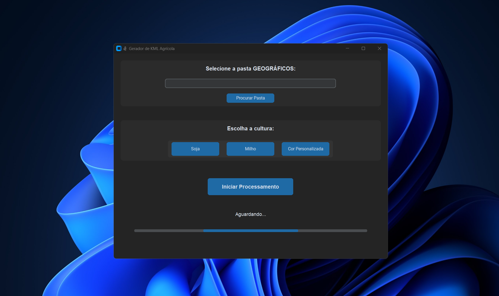

# 🌾 Gerador de KML Agrícola


Uma aplicação gráfica para transformar arquivos CSV de coordenadas e dados do CAR em arquivos KML prontos para Google Earth, Mapas e outros sistemas de geolocalização. Ideal para produtores, engenheiros agrônomos e empresas do agro.

> _"Facilitando o agro com tecnologia."_ 🚜🌱

---

## 🚀 Por que usar o Gerador de KML?

- 100% visual, fácil de usar, sem necessidade de conhecimento em programação.
- Gera KML unificado e arquivos individuais automaticamente.
- Integração com dados do CAR: baixe e converta shapefiles por recibo.
- Personalização de cores e culturas.
- Pronto para grandes volumes de áreas e compatível com sistemas de gestão agrícola.

---

## ✨ Funcionalidades

- Seleção fácil de pastas contendo arquivos `.csv`.
- Escolha rápida de **cultura** (Soja, Milho) ou definição de **cor personalizada** para os polígonos.
- Processamento automático:
  - Formatação e padronização dos CSVs.
  - Geração de arquivos KML individuais para cada área.
  - Criação de um **KML unificado** com todos os polígonos.
- Interface gráfica moderna e intuitiva (**CustomTkinter**).
- Barra de progresso e status em tempo real.
- Edição dos nomes das áreas durante o processamento.
- Compatibilidade com sistemas de gestão agrícola.
- **Nova função:** Adicione shapefiles de fazendas diretamente pelo número do recibo do CAR, baixando, convertendo e unificando ao KML final.

---

## 🛠 Tecnologias Utilizadas

- Python 3.10+
- [CustomTkinter](https://github.com/TomSchimansky/CustomTkinter)
- [Pandas](https://pandas.pydata.org/)
- [GeoPandas](https://geopandas.org/)
- [Shapely](https://shapely.readthedocs.io/)
- [SimpleKML](https://simplekml.readthedocs.io/)
- [Colorama](https://pypi.org/project/colorama/)
- [PyProj](https://pyproj4.github.io/pyproj/)
- [Fiona](https://fiona.readthedocs.io/)
- [Requests](https://docs.python-requests.org/)

---

## 🏗 Pré-requisitos

- Python 3.10 ou superior
- (Opcional) Git instalado para clonar o repositório
- Conexão com a internet para baixar shapefiles via CAR
- Sistema operacional Windows ou Linux

---

## 📦 Como Instalar

1. **Clone o repositório:**

   ```bash
   git clone https://github.com/Frraz/Gerador-de-KML.git
   cd Gerador-de-KML
   ```

2. **Crie e ative um ambiente virtual (recomendado):**

   ```bash
   python -m venv venv
   # No Windows:
   venv\Scripts\activate
   # No Linux/macOS:
   source venv/bin/activate
   ```

3. **Instale as dependências:**

   ```bash
   pip install -r requirements.txt
   ```

4. **Execute a aplicação:**

   ```bash
   python main.py
   ```

---

## 🗂 Estrutura de Saída

Após o processamento, os arquivos gerados estarão organizados assim:

```
/SuaPastaSelecionada
├── /csv           # CSVs formatados
├── /kml           # Arquivos KML individuais (incluindo fazendas adicionadas)
├── /shapefiles    # Shapefiles das fazendas baixados e processados
└── todos_poligonos.kml  # KML único com todos os polígonos e fazendas
```

---

## 📸 Exemplos de Uso

### Tela Principal


---

## 👨‍🌾 Como Usar

1. Clique em **Procurar Pasta** e selecione a pasta com os arquivos `.csv`.
2. Escolha a **cultura** ou defina uma **cor personalizada**.
3. Clique em **Iniciar Processamento**.
4. Insira os nomes das áreas quando solicitado.
5. Caso deseje, adicione shapefiles de fazendas informando o recibo do CAR e o nome da área.
6. Aguarde a finalização — o KML será gerado automaticamente!

---

## ⚡ Gerar Executável (Opcional)

Você pode compilar o programa como `.exe` usando o **PyInstaller** ou o **auto-py-to-exe**.

#### Usando PyInstaller (recomendado):

1. Instale a ferramenta:

   ```bash
   pip install pyinstaller
   ```

2. Gere o executável:

   ```bash
   pyinstaller --onefile --windowed main.py
   ```

3. O executável estará na pasta `/dist` dentro do diretório do projeto.

#### Usando auto-py-to-exe (opcional):

1. Instale a ferramenta:

   ```bash
   pip install auto-py-to-exe
   ```

2. Execute:

   ```bash
   auto-py-to-exe
   ```

3. Configure conforme desejar e clique em **Convert .py to .exe**.

---

## ⚠️ Observações

- Os arquivos `.csv` devem conter colunas no formato correto (ponto, latitude, longitude...).
- É necessário um mínimo de **3 pontos válidos** para formar um polígono.
- Se o nome da área for deixado em branco, ela será ignorada.
- Para adicionar shapefiles de fazendas, tenha em mãos o número do recibo do CAR conforme orientado na aplicação.
- **Não envie arquivos .exe ou grandes para este repositório!** Use a área de Releases do GitHub ou outro meio para compartilhar executáveis.

---

## 🤝 Contribuindo

Contribuições são bem-vindas!  
Abra uma [issue](https://github.com/Frraz/Gerador-de-KML/issues) para sugestões, bugs ou dúvidas, ou envie um Pull Request com melhorias.

---

## 📄 Licença

Este projeto está licenciado sob os termos da licença MIT - veja o arquivo [LICENSE](LICENSE) para detalhes.

---

## 💬 Contato

Desenvolvido por **Warley Ferraz**  
📧 Email: [warley.ferraz.wf@gmail.com](mailto:warley.ferraz.wf@gmail.com)  
🔗 [LinkedIn](https://www.linkedin.com/in/warley-ferraz-almeida-280a55185/)

---